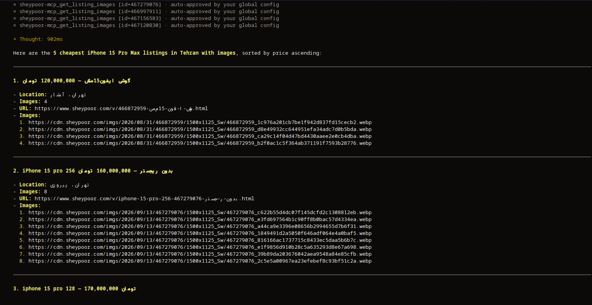

<div align="center">

# 🛍️ Sheypoor MCP

**Model Context Protocol server for [Sheypoor](https://www.sheypoor.com) — Iran's largest classifieds marketplace.**

[](LICENSE)
[](https://nodejs.org/)
[](https://modelcontextprotocol.io/)

Search listings · Get product details · Manage your account · Chat · Bookmark — all from Claude, Cursor, or any MCP host.

</div>

---

## What is this?

`sheypoor-mcp` is an [MCP](https://modelcontextprotocol.io/) server that exposes the
Sheypoor marketplace as tools an LLM can call. Ask Claude:

> *"Find the 5 cheapest iPhone 15 Pro Max in Tehran with images."*

…and it will chain `list_provinces` → `search_listings` → `get_listing` → produce a table.

---

## Preview



---

## Quick start (recommended)

Use the hosted Cloudflare Worker — no install needed:

**Remote URL:** `https://sheypoor-mcp.farhamaghdasi.workers.dev/`

### MCP host config

Any MCP host that supports remote HTTP/SSE transport. Point it at:

```json
{
  "mcpServers": {
    "sheypoor": {
      "type": "remote",
      "url": "https://sheypoor-mcp.farhamaghdasi.workers.dev/"
    }
  }
}
```

Restart your MCP host after saving. The tools should appear automatically.

---

## Local install

If you prefer running it locally, or want to develop:

```bash
git clone https://github.com/farhamaghdasi/sheypoor-mcp.git
cd sheypoor-mcp
pnpm install
pnpm build
node dist/bin.js
```

Then point your MCP host at `node dist/bin.js` as a local stdio command.

---

## From source (development)

```bash
git clone https://github.com/farhamaghdasi/sheypoor-mcp.git
cd sheypoor-mcp
pnpm install
pnpm typecheck
pnpm test
pnpm lint
pnpm build
```

Layout:

```
src/
├── bin.ts              CLI entry
├── index.ts            public exports
├── client/             HTTP client (reusable without MCP)
├── mcp/                MCP server (tools, resources, prompts)
└── util/               logger, throttle, paths
tools/legacy-py/        frozen Python reference
docs/                   architecture + API notes
```

---

## Tools

| Tool | Purpose |
|------|---------|
| `search_listings` | Search with query/city/category/price/sort |
| `search_listings_all` | Auto-paginate up to N pages |
| `get_search_suggestions` | Autocomplete a prefix |
| `get_popular_searches` | Trending terms |
| `get_listing` | Full listing detail by ID |
| `get_listing_from_url` | Full listing detail from a URL |
| `get_listing_images` | Full-size image URLs |
| `list_categories` | Top-level categories |
| `get_category_tree` | Full or partial category tree |
| `search_categories` | Fuzzy-match a category |
| `list_provinces` | Iranian provinces |
| `list_cities` | Cities of a province |
| `login_start` / `login_complete` | Phone + SMS login |
| `logout` | Clear cookies |
| `whoami` | Authenticated profile |
| `get_my_listings` | Your listings |
| `get_my_bookmarks` | Your saved listings |
| `get_my_wallets` | Payment wallets |
| `get_chat_rooms` | Chat room list |
| `get_chat_unread` | Unread message count |

## Resources

- `sheypoor://categories`
- `sheypoor://locations`
- `sheypoor://versions`

## Prompts

- `find_cheapest`
- `analyze_listing`
- `market_snapshot`
- `compare_listings`

---

## Configuration

All config is via environment variables:

| Var | Default | Purpose |
|-----|---------|---------|
| `SHEYPOOR_COOKIE_FILE` | OS config dir | Cookie jar path |
| `SHEYPOOR_LOG_LEVEL` | `info` | pino level |
| `SHEYPOOR_TIMEOUT_MS` | `20000` | HTTP timeout |
| `SHEYPOOR_MIN_DELAY_MS` | `500` | Min throttle |
| `SHEYPOOR_MAX_DELAY_MS` | `1500` | Max throttle |

Example:

```json
{
  "mcpServers": {
    "sheypoor": {
      "command": "npx",
      "args": ["-y", "sheypoor-mcp"],
      "env": {
        "SHEYPOOR_COOKIE_FILE": "/Users/me/.config/sheypoor-mcp/cookies.json",
        "SHEYPOOR_LOG_LEVEL": "debug"
      }
    }
  }
}
```

---

## Programmatic use

```ts
import { SheypoorClient } from "sheypoor-mcp";

const cli = new SheypoorClient();

// Search
const page = await cli.search.page({ q: "آیفون", city: "tehran", sort: "cheapest" });
for (const listing of cli.search.extractListings(page)) {
  console.log(listing.id, listing.title);
}

// Detail
const detail = await cli.listing.detail("466838381");
console.log(detail.title, detail.phone, detail.images.length);

// Auth
const pending = await cli.auth.start("09000000000");
// ... user receives SMS ...
const tokens = await cli.auth.complete(pending, "1234");
console.log("Logged in:", tokens.userName);
```

---

## Cloudflare Worker

The Worker is deployed at `https://sheypoor-mcp.farhamaghdasi.workers.dev/`.

To deploy your own:

```bash
wrangler deploy
```

See `wrangler.toml` for configuration. The Worker uses `WebStandardStreamableHTTPServerTransport`
and in-memory cookies by default. For persistent cookies, configure a KV binding in `wrangler.toml`.

---

## Legal

Not affiliated with Sheypoor. Reverse-engineered from public traffic. Respect
[robots.txt](https://www.sheypoor.com/robots.txt) and Sheypoor's Terms of Service.
Do not scrape personal data, do not spam, and do not use the analytics endpoint
(`track_click`) unless simulating a genuine user.

---

## License

MIT
